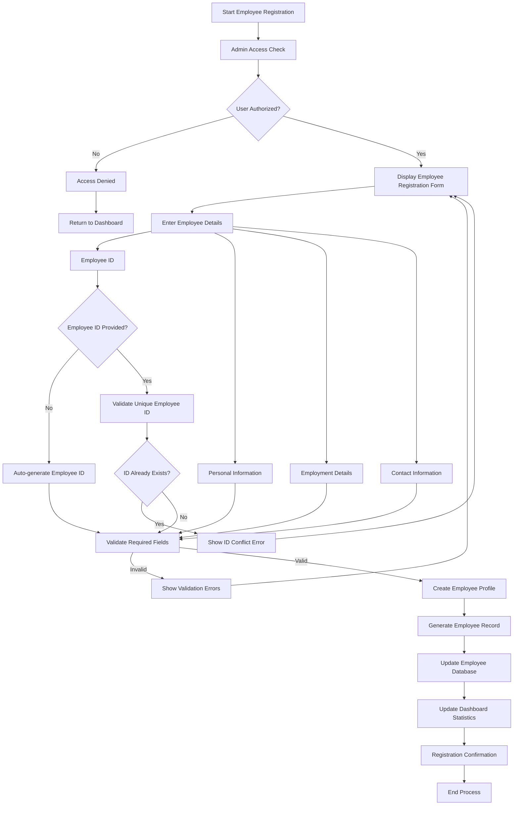
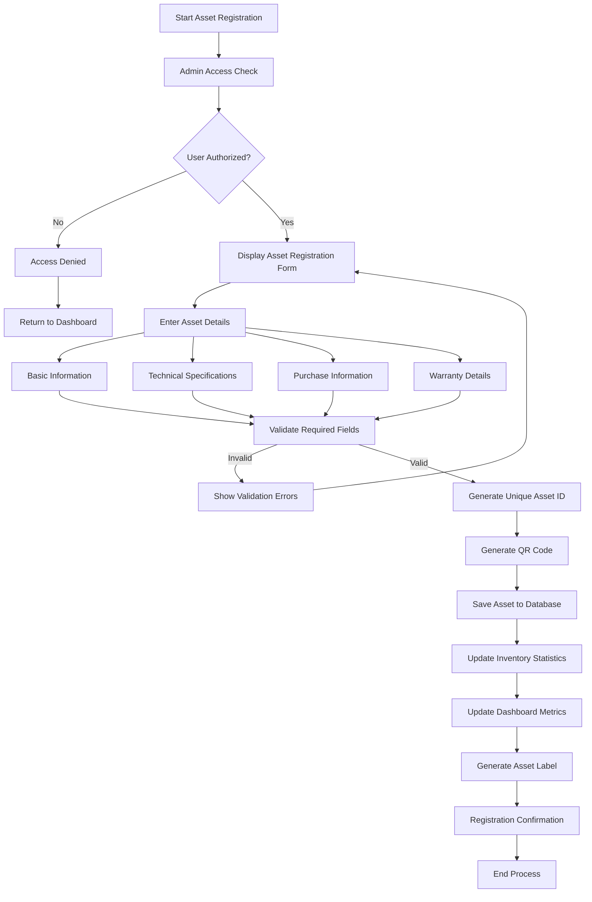
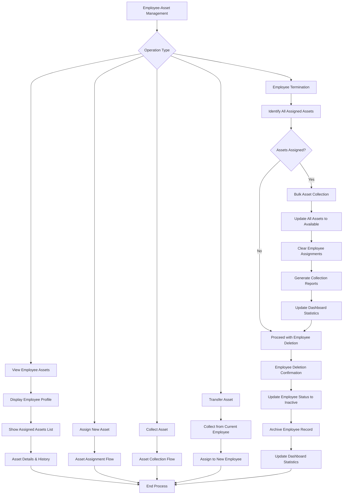
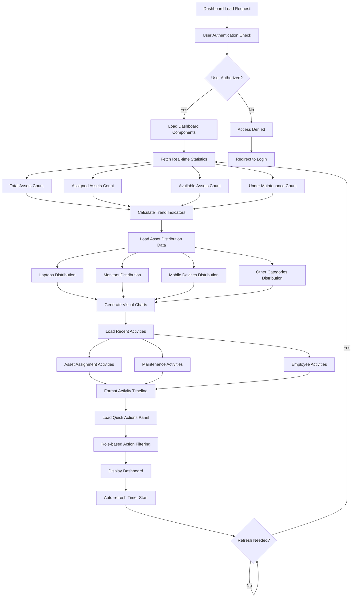
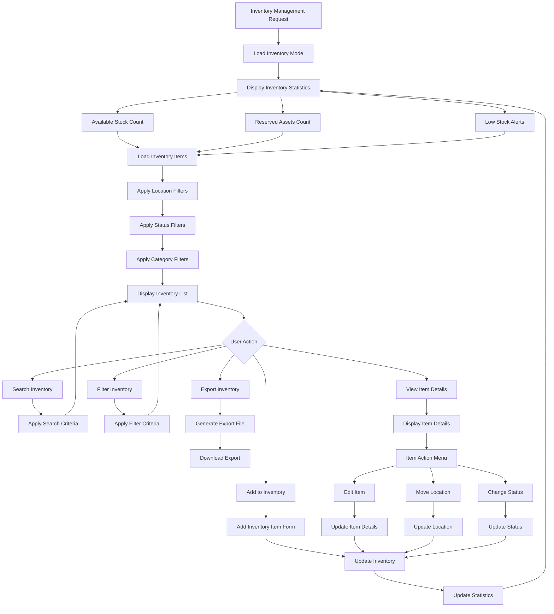
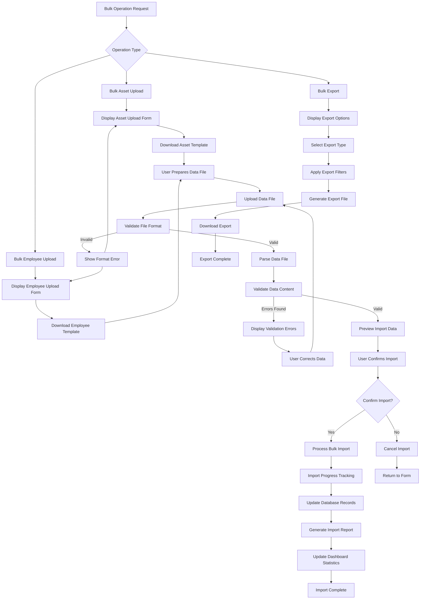

# TrackStix: Mindful asset management by mindstix

## Software Requirements Specification

**Version:**  
1.0

**Date:**  
Aug 8, 2024

**Prepared For:**  
Mindstix Software labs

**Revision History**

| Date | Authors | Note |
| :---- | :---- | :---- |
| Aug 8, 2024 | Nishant Bondre nishant.bondre@mindstixfoundation.org Uday Narsale uday.narsale@mindstixfoundation.org | First draft. |
|  |  |  |

 

# 

# Table of Contents

[**Asset Management System	1**](#heading=h.1pq8urucum3o)

[Software Requirements Specification	1](#heading=h.8n5iagaon8k6)

[Document Information	1](#heading=h.quig12vnwylz)

[1\. Introduction	3](#1.-introduction)

[1.1 Purpose	3](#1.1-purpose)

[1.2 Document Scope	4](#1.2-document-scope)

[1.3 Intended Audience	4](#1.3-intended-audience)

[2\. Objectives	4](#2.-objectives)

[2.1 Operational Efficiency	4](#2.1-operational-efficiency)

[2.2 Comprehensive Asset Tracking	4](#2.2-comprehensive-asset-tracking)

[2.3 Enhanced Visibility	5](#2.3-enhanced-visibility)

[2.4 Regulatory Compliance	5](#2.4-regulatory-compliance)

[2.5 Cost Optimization	5](#2.5-cost-optimization)

[2.6 Lifecycle Management	5](#2.6-lifecycle-management)

[2.7 Advanced Reporting	5](#2.7-advanced-reporting)

[2.8 Security and Access Control	5](#2.8-security-and-access-control)

[3\. High-level Scope	5](#3.-high-level-scope)

[3.1 System Overview	5](#3.1-system-overview)

[3.2 Core Modules	6](#3.2-core-modules)

[3.2.1 Asset Registration & Cataloging	6](#3.2.1-asset-registration-&-cataloging)

[3.2.2 Employee Management & Profile System	6](#3.2.2-employee-management-&-profile-system)

[3.2.3 Asset-Employee Assignment System	6](#3.2.3-asset-employee-assignment-system)

[3.2.4 Dashboard & Analytics System	7](#3.2.4-dashboard-&-analytics-system)

[3.2.5 Inventory Management System	7](#3.2.5-inventory-management-system)

[3.2.6 Maintenance Management	7](#3.2.6-maintenance-management)

[3.2.7 User Management & Access Control	7](#3.2.7-user-management-&-access-control)

[3.2.8 Reporting & Analytics	7](#3.2.8-reporting-&-analytics)

[3.2.9 Workflow & Approval Management	7](#3.2.9-workflow-&-approval-management)

[3.2.10 Integration & API Management	7](#3.2.10-integration-&-api-management)

[3.3 Out of Scope	8](#3.3-out-of-scope)

[4\. User Roles and Permissions	8](#4.-user-roles-and-permissions)

[4.1 System Administrator	8](#4.1-system-administrator)

[4.2 HR	8](#4.2-hr)

[5\. Detailed Features	9](#5.-detailed-features)

[5.1 Asset Registration Module	9](#5.1-asset-registration-module)

[5.1.1 Asset Information Management	9](#5.1.1-asset-information-management)

[5.1.2 Barcode/QR Code Management	9](#5.1.2-barcode/qr-code-management)

[5.2 Employee Management Module	10](#5.2-employee-management-module)

[5.2.1 Employee Registration and Profile Management	10](#5.2.1-employee-registration-and-profile-management)

[5.2.2 Employee Search and Filtering	10](#5.2.2-employee-search-and-filtering)

[5.2.3 Employee Status Management	11](#5.2.3-employee-status-management)

[5.2.4 Bulk Employee Operations	11](#5.2.4-bulk-employee-operations)

[5.3 Asset-Employee Assignment Module	11](#5.3-asset-employee-assignment-module)

[5.3.1 Asset Assignment Process	11](#5.3.1-asset-assignment-process)

[5.3.2 Asset Unassignment/Collection Process	12](#5.3.2-asset-unassignment/collection-process)

[5.3.3 Assignment History and Tracking	12](#5.3.3-assignment-history-and-tracking)

[5.4 Dashboard & Analytics Module	13](#5.4-dashboard-&-analytics-module)

[5.4.1 Real-time Statistics Dashboard	13](#5.4.1-real-time-statistics-dashboard)

[5.4.2 Quick Actions Panel	13](#5.4.2-quick-actions-panel)

[5.4.3 Recent Activities Timeline	14](#5.4.3-recent-activities-timeline)

[5.4.4 Asset Distribution Visualization	14](#5.4.4-asset-distribution-visualization)

[5.5 Inventory Management Module	14](#5.5-inventory-management-module)

[5.5.1 Inventory Tracking System	14](#5.5.1-inventory-tracking-system)

[5.5.2 Stock Level Management	15](#5.5.2-stock-level-management)

[5.5.3 Location-based Organization	15](#5.5.3-location-based-organization)

[5.5.4 Inventory Export and Reporting	15](#5.5.4-inventory-export-and-reporting)

[5.6 Asset Tracking Module	16](#5.6-asset-tracking-module)

[5.6.1 Location Tracking	16](#5.6.1-location-tracking)

[5.6.2 Status Management	16](#5.6.2-status-management)

[5.6.3 Asset Search and Filtering	16](#5.6.3-asset-search-and-filtering)

[5.6.4 View Management (Grid/List Toggle)	17](#5.6.4-view-management-(grid/list-toggle))

[5.7 Maintenance Management Module	17](#5.7-maintenance-management-module)

[5.7.1 Preventive Maintenance	17](#5.7.1-preventive-maintenance)

[5.7.2 Maintenance Requests	17](#5.7.2-maintenance-requests)

[5.7.3 Service Provider Management	18](#5.7.3-service-provider-management)

[5.7.4 Maintenance Analytics and Reporting	18](#5.7.4-maintenance-analytics-and-reporting)

[5.8 User Management Module	18](#5.8-user-management-module)

[5.8.1 Authentication and Authorization	18](#5.8.1-authentication-and-authorization)

[5.8.2 User Profile Management	19](#5.8.2-user-profile-management)

[5.9 Reporting Module	19](#5.9-reporting-module)

[5.9.1 Standard Reports	19](#5.9.1-standard-reports)

[5.9.2 Custom Report Builder	19](#5.9.2-custom-report-builder)

[5.9.3 Export and Data Management	20](#5.9.3-export-and-data-management)

[5.10 Bulk Operations Module	20](#5.10-bulk-operations-module)

[5.10.1 Bulk Asset Operations	20](#5.10.1-bulk-asset-operations)

[5.10.2 Bulk Employee Operations	21](#5.10.2-bulk-employee-operations)

[5.10.3 Data Import/Export Management	21](#5.10.3-data-import/export-management)

[6\. System Flowcharts	21](#6.-system-flowcharts)

[6.1 Employee Registration Flow	22](#6.1-employee-registration-flow)

[6.2 Asset Registration Flow	22](#6.2-asset-registration-flow)

[6.3 Asset Assignment Flow	23](#6.3-asset-assignment-flow)

[6.4 Asset Collection/Unassignment Flow	23](#6.4-asset-collection/unassignment-flow)

[6.5 Employee-Asset Relationship Management Flow	24](#6.5-employee-asset-relationship-management-flow)

[6.6 Dashboard Data Flow	24](#6.6-dashboard-data-flow)

[6.7 Inventory Management Flow	25](#6.7-inventory-management-flow)

[6.8 Bulk Operations Flow	25](#6.8-bulk-operations-flow)

[6.9 Maintenance Request Flow	26](#6.9-maintenance-request-flow)

[7\. Success Criteria	26](#7.-success-criteria)

[7.1 Functional Success Criteria	26](#7.1-functional-success-criteria)

[7.2 Performance Success Criteria	27](#7.2-performance-success-criteria)

[7.3 User Acceptance Criteria	27](#7.3-user-acceptance-criteria)

[8\. Non-Functional Requirements	27](#8.-non-functional-requirements)

[8.1 Performance Requirements	27](#8.1-performance-requirements)

[8.2 Security Requirements	28](#8.2-security-requirements)

[8.3 Reliability Requirements	28](#8.3-reliability-requirements)

[8.4 Usability Requirements	28](#8.4-usability-requirements)

[8.5 Compatibility Requirements	29](#8.5-compatibility-requirements)

[9\. Assumptions and Constraints	29](#9.-assumptions-and-constraints)

[9.1 Assumptions	29](#9.1-assumptions)

[9.2 Technical Constraints	30](#9.2-technical-constraints)

[9.3 Business Constraints	30](#9.3-business-constraints)

[10\. Conclusion	30](#10.-conclusion)

[10.1 Expected Benefits	30](#10.1-expected-benefits)

[10.2 Implementation Success Factors	31](#10.2-implementation-success-factors)

[10.3 Next Steps	31](#10.3-next-steps)

## 

## 1\. Introduction {#1.-introduction}

### 1.1 Purpose {#1.1-purpose}

This Software Requirements Specification (SRS) document provides a comprehensive description of the Asset Management System being developed for Mindstix Software labs. The system is designed to streamline asset tracking, management, and reporting processes within the organization.

The Asset Management System will serve as a centralized platform for managing all organizational assets including hardware, equipment, and other valuable resources. This document outlines the functional and non-functional requirements, system constraints, and design specifications necessary for successful implementation.

### 1.2 Document Scope {#1.2-document-scope}

This document covers:

- Comprehensive system requirements and specifications  
- Detailed functional requirements for each system module  
- User interface requirements and design guidelines  
- System architecture and technical specifications  
- Performance, security, and reliability requirements  
- Integration requirements with existing systems

### 1.3 Intended Audience {#1.3-intended-audience}

This document is intended for:

- Development team members and technical architects  
- Project managers and business analysts  
- Quality assurance and testing teams  
- System administrators and IT support staff  
- End users and stakeholders  
- Management and decision-makers

---

## 2\. Objectives {#2.-objectives}

The Asset Management System aims to achieve the following key objectives:

### 2.1 Operational Efficiency {#2.1-operational-efficiency}

Streamline asset management processes by automating manual tasks, and providing real-time access to asset information. This will significantly reduce the time and effort required for asset-related operations.

### 2.2 Comprehensive Asset Tracking {#2.2-comprehensive-asset-tracking}

Implement a robust tracking system that monitors assets throughout their entire lifecycle, from procurement to disposal. This includes status monitoring, and maintenance scheduling.

### 2.3 Enhanced Visibility {#2.3-enhanced-visibility}

Provide complete visibility into asset utilization, availability, and performance metrics through intuitive dashboards and detailed reporting capabilities.

### 2.4 Regulatory Compliance {#2.4-regulatory-compliance}

Ensure compliance with organizational policies, industry standards, and regulatory requirements through automated compliance checks and audit trail maintenance.

### 2.5 Cost Optimization {#2.5-cost-optimization}

Optimize asset utilization and reduce unnecessary expenses through better planning, preventive maintenance scheduling, and informed decision-making based on asset performance data.

### 2.6 Lifecycle Management {#2.6-lifecycle-management}

Manage complete asset lifecycles including procurement, deployment, maintenance, upgrades, and disposal with proper documentation.

### 2.7 Advanced Reporting {#2.7-advanced-reporting}

Generate comprehensive reports and analytics to support strategic decision-making, budget planning, and performance evaluation.

### 2.8 Security and Access Control {#2.8-security-and-access-control}

Implement robust security measures and role-based access control to protect sensitive asset information and ensure data integrity.

---

## 3\. High-level Scope {#3.-high-level-scope}

### 3.1 System Overview {#3.1-system-overview}

The Asset Management System is a comprehensive web-based application designed to manage all aspects of organizational assets and their relationships with employees. The system provides a centralized platform for asset registration, employee management, asset assignment/unassignment, tracking, maintenance, and reporting with real-time dashboard analytics and inventory management capabilities.

### 3.2 Core Modules {#3.2-core-modules}

#### 3.2.1 Asset Registration & Cataloging {#3.2.1-asset-registration-&-cataloging}

- Asset information capture and storage  
- Category and classification management  
- Barcode/QR code generation and scanning  
- Asset image and document attachment

#### 3.2.2 Employee Management & Profile System {#3.2.2-employee-management-&-profile-system}

- Employee registration and profile management
- Employee search, filtering, and categorization
- Employee status tracking and lifecycle management
- Bulk employee operations and data import/export

#### 3.2.3 Asset-Employee Assignment System {#3.2.3-asset-employee-assignment-system}

- Asset assignment to employees with validation
- Asset collection/unassignment workflows
- Assignment history and audit trail
- Employee-asset relationship mapping

#### 3.2.4 Dashboard & Analytics System {#3.2.4-dashboard-&-analytics-system}

- Real-time statistics and key performance indicators
- Interactive asset distribution charts and visualizations
- Recent activities timeline and notifications
- Quick action buttons for common operations

#### 3.2.5 Inventory Management System {#3.2.5-inventory-management-system}

- Available and spare asset tracking
- Stock level monitoring and alerts
- Location-based asset organization
- Inventory export and reporting capabilities

#### 3.2.6 Maintenance Management {#3.2.6-maintenance-management}

- Preventive maintenance scheduling  
- Maintenance request management  
- Service history tracking  
- Vendor and service provider management

#### 3.2.7 User Management & Access Control {#3.2.7-user-management-&-access-control}

- Role-based access control  
- User authentication and authorization  
- Permission management  
- User activity logging

#### 3.2.8 Reporting & Analytics {#3.2.8-reporting-&-analytics}

- Standard and custom report generation  
- Dashboard with key performance indicators  
- Data visualization and charts  
- Export capabilities (PDF, Excel, CSV)

#### 3.2.9 Workflow & Approval Management {#3.2.9-workflow-&-approval-management}

- Transfer and assignment processes  
- Disposal and retirement workflows  
- Notification and alert system on warranty

#### 3.2.10 Integration & API Management {#3.2.10-integration-&-api-management}

- REST API for third-party integrations  
- Data import/export capabilities  
- Integration with existing systems  
- Webhook support for real-time updates

### 3.3 Out of Scope {#3.3-out-of-scope}

- Financial accounting and depreciation calculations  
- Procurement and vendor management systems  
- Human resource management functions (beyond asset assignment)  
- Project management capabilities  
- Customer relationship management

---

##  4\. User Roles and Permissions {#4.-user-roles-and-permissions}

### 4.1 System Administrator {#4.1-system-administrator}

**Responsibilities:**

- Complete system access and configuration  
- User account management and role assignment  
- System maintenance and backup operations  
- Security policy implementation and monitoring
- Employee management (add, edit, delete employees)
- Asset assignment and unassignment operations
- Complete asset lifecycle management
- Dashboard configuration and analytics access
- Inventory management and bulk operations
- Maintenance scheduling and management

### 4.2 HR {#4.2-hr}

**Responsibilities:**

- View-only access to all system data and configurations managed by the System Administrator  
- Access to reports, logs, and records for monitoring and compliance purposes  
- No rights to modify, delete, or configure system settings
- Read-only access to employee profiles and asset assignments
- Generate and export reports for HR compliance
- View dashboard analytics and statistics
- Access to inventory information (read-only)

---

## 5\. Detailed Features {#5.-detailed-features}

### 5.1 Asset Registration Module {#5.1-asset-registration-module}

#### 5.1.1 Asset Information Management {#5.1.1-asset-information-management}

**Feature Description:** Comprehensive asset information capture and management system.

**Functional Requirements:**

- Asset basic information (name, model, serial number, manufacturer)  
- Asset categorization and classification (Laptop, Monitor, Mobile, Tablets, iPads, Accessories)
- Purchase information (date, cost, vendor, warranty details)  
- Technical specifications and documentation (RAM, CPU, OS, Storage)
- Asset images and attachments  
- Custom fields for specific asset types
- Brand and model dropdowns for data consistency
- INR currency support for cost tracking

#### 5.1.2 Barcode/QR Code Management (**Future Scope**) {#5.1.2-barcode/qr-code-management-(future-scope)}

**Feature Description:** QR code generation and management for asset identification and tracking.

**Functional Requirements:**

- Automatic QR code generation upon asset registration  
- QR code display in asset detail views
- Downloadable QR code labels for printing
- QR code-based asset lookup and identification
- Mobile scanning capabilities  
- Bulk QR code generation for multiple assets

### 5.2 Employee Management Module {#5.2-employee-management-module}

#### 5.2.1 Employee Registration and Profile Management {#5.2.1-employee-registration-and-profile-management}

**Feature Description:** Comprehensive employee information management system for asset assignment purposes.

**Functional Requirements:**

- Employee basic information (Employee ID, Name, Email, Phone)
- Employment details (Position, Department, Location, Join Date)
- Personal information (Date of Birth) - optional
- Employee ID auto-generation if not provided
- Employee profile creation, editing, and deletion
- Employee photo and document attachment
- Employee contact information management
- Employee status tracking (Active, Inactive, On Leave, etc.)

#### 5.2.2 Employee Search and Filtering {#5.2.2-employee-search-and-filtering}

**Feature Description:** Advanced search and filtering capabilities for employee management.

**Functional Requirements:**

- Search employees by ID, name, department, or location
- Filter employees by status, department, location
- Grid view and list view toggle
- Sorting by various fields (name, join date, status)
- Real-time search with instant results
- Export filtered employee lists

#### 5.2.3 Employee Status Management {#5.2.3-employee-status-management}

**Feature Description:** Employee lifecycle and status tracking system.

**Functional Requirements:**

- Employee status definitions (Active, Inactive, On Leave, Maternity Leave, Sabbatical Leave)
- Status change workflows and approvals
- Status history tracking
- Automated asset handling based on status changes
- Employee termination workflow with asset collection

#### 5.2.4 Bulk Employee Operations {#5.2.4-bulk-employee-operations}

**Feature Description:** Bulk operations for efficient employee data management.

**Functional Requirements:**

- Bulk employee upload via Excel/CSV files
- Employee data template download
- Data validation and error reporting
- Preview before bulk import
- Bulk employee status updates
- Bulk export of employee data

### 5.3 Asset-Employee Assignment Module {#5.3-asset-employee-assignment-module}

#### 5.3.1 Asset Assignment Process {#5.3.1-asset-assignment-process}

**Feature Description:** Comprehensive asset assignment workflow to employees.

**Functional Requirements:**

- Employee lookup by ID with auto-population of employee details
- Available asset selection with real-time availability check
- Asset type and specification display during assignment
- Assignment date and location tracking
- Assignment notes and documentation
- Assignment validation (employee exists, asset available)
- Automatic asset status update to "In Use"
- Assignment confirmation and notification
- Assignment record creation with audit trail

#### 5.3.2 Asset Unassignment/Collection Process {#5.3.2-asset-unassignment/collection-process}

**Feature Description:** Asset collection and unassignment workflow from employees.

**Functional Requirements:**

- Assigned asset selection with current employee display
- Collection date and reason tracking
- Collection reasons (Employee Left, Reassignment, Maintenance, Upgrade, Other)
- Collection notes and documentation
- Asset condition assessment during collection
- Automatic asset status update to "Available"
- Employee profile update to remove asset assignment
- Collection confirmation and audit trail
- Return to inventory workflow

#### 5.3.3 Assignment History and Tracking {#5.3.3-assignment-history-and-tracking}

**Feature Description:** Complete assignment history and relationship tracking.

**Functional Requirements:**

- Employee-wise asset assignment history
- Asset-wise assignment history with previous owners
- Assignment timeline and duration tracking
- Assignment status tracking (Active, Returned, Transferred)
- Historical assignment reports
- Asset utilization analytics
- Employee asset usage patterns

### 5.4 Dashboard & Analytics Module {#5.4-dashboard-&-analytics-module}

#### 5.4.1 Real-time Statistics Dashboard {#5.4.1-real-time-statistics-dashboard}

**Feature Description:** Comprehensive real-time dashboard with key performance indicators and statistics.

**Functional Requirements:**

- Total assets counter with trend indicators
- Assigned assets count and percentage
- Available assets count and availability metrics
- Under maintenance assets count and status
- Asset distribution by category with visual progress bars
- Monthly trend indicators with percentage changes
- Real-time data updates and refresh capabilities
- Role-based dashboard customization

#### 5.4.2 Quick Actions Panel {#5.4.2-quick-actions-panel}

**Feature Description:** Quick access panel for common operations and workflows.

**Functional Requirements:**

- Register new asset quick action
- Issue asset to employee quick action
- Schedule maintenance quick action
- Collect asset from employee quick action
- Direct navigation to form pages
- Context-sensitive action availability
- Visual action indicators with appropriate icons

#### 5.4.3 Recent Activities Timeline {#5.4.3-recent-activities-timeline}

**Feature Description:** Real-time activity feed showing recent system activities.

**Functional Requirements:**

- Asset assignment activities with timestamps
- Maintenance completion notifications
- Employee onboarding activities
- Asset status change notifications
- Chronological activity ordering
- Activity filtering and search
- Activity details and context information

#### 5.4.4 Asset Distribution Visualization {#5.4.4-asset-distribution-visualization}

**Feature Description:** Visual representation of asset distribution across categories.

**Functional Requirements:**

- Asset category breakdown with percentages
- Visual progress bars for each category
- Asset allocation vs. total capacity display
- Interactive category selection and filtering
- Category-wise asset counts and statistics
- Color-coded category identification

### 5.5 Inventory Management Module {#5.5-inventory-management-module}

#### 5.5.1 Inventory Tracking System {#5.5.1-inventory-tracking-system}

**Feature Description:** Comprehensive inventory tracking for available and spare assets.

**Functional Requirements:**

- Available asset inventory with real-time counts
- Reserved asset tracking and management
- Low stock alerts and notifications
- Asset availability status monitoring
- Inventory vs. assets mode toggle
- Location-based inventory organization
- Inventory search and filtering capabilities

#### 5.5.2 Stock Level Management {#5.5.2-stock-level-management}

**Feature Description:** Stock level monitoring and management system.

**Functional Requirements:**

- Stock level thresholds and alerts
- Automatic stock level calculations
- Stock replenishment notifications
- Stock movement tracking and history
- Stock level reporting and analytics
- Critical stock level indicators

#### 5.5.3 Location-based Organization {#5.5.3-location-based-organization}

**Feature Description:** Location-based asset organization and tracking.

**Functional Requirements:**

- Multiple location support (Warehouse, Office locations)
- Location-based asset filtering and search
- Asset movement between locations
- Location capacity and utilization tracking
- Location-wise inventory reports
- Asset location history and audit trail

#### 5.5.4 Inventory Export and Reporting {#5.5.4-inventory-export-and-reporting}

**Feature Description:** Comprehensive inventory reporting and export capabilities.

**Functional Requirements:**

- Inventory export to Excel/CSV formats
- Inventory summary reports
- Location-wise inventory reports
- Stock level reports and analytics
- Inventory audit reports
- Scheduled inventory reporting

### 5.6 Asset Tracking Module {#5.6-asset-tracking-module}

#### 5.6.1 Location Tracking {#5.6.1-location-tracking}

**Feature Description:** Real-time asset location and movement tracking.

**Functional Requirements:**

- Asset location assignment and updates
- Location history tracking
- Multi-location support (Warehouse, Office locations)
- Location-based asset search and filtering
- Asset movement notifications

#### 5.6.2 Status Management {#5.6.2-status-management}

**Feature Description:** Asset status tracking throughout lifecycle.

**Functional Requirements:**

- Status definitions (Available, In Use, Under Maintenance, Retired, Reserved)  
- Status change workflows and approvals  
- Status history tracking  
- Automated status updates based on conditions
- Status-based filtering and reporting

#### 5.6.3 Asset Search and Filtering {#5.6.3-asset-search-and-filtering}

**Feature Description:** Advanced asset search and filtering capabilities.

**Functional Requirements:**

- Real-time asset search by multiple criteria
- Advanced filtering by asset type, status, location, brand
- Search by asset ID, serial number, or model
- Filter combinations and saved search preferences
- Search result sorting and organization
- Export filtered asset lists

#### 5.6.4 View Management (Grid/List Toggle) {#5.6.4-view-management-(grid/list-toggle)}

**Feature Description:** Flexible view options for asset display and management.

**Functional Requirements:**

- Grid view with asset cards and visual representations
- List view with detailed tabular information
- View preference saving and user customization
- Responsive view adaptation for different screen sizes
- View-specific action buttons and operations
- Seamless switching between view modes

### 5.7 Maintenance Management Module {#5.7-maintenance-management-module}

#### 5.7.1 Preventive Maintenance {#5.7.1-preventive-maintenance}

**Feature Description:** Scheduled maintenance planning and execution.

**Functional Requirements:**

- Maintenance schedule creation and management  
- Recurring maintenance task automation  
- Maintenance calendar and notifications  
- Maintenance checklist and procedures

#### 5.7.2 Maintenance Requests {#5.7.2-maintenance-requests}

**Feature Description:** Maintenance request submission and tracking.

**Functional Requirements:**

- Maintenance request form submission  
- Priority assignment and escalation  
- Request status tracking and updates  
- Service provider assignment and coordination
- Maintenance cost tracking in INR
- Asset unavailability during maintenance

#### 5.7.3 Service Provider Management {#5.7.3-service-provider-management}

**Feature Description:** Service provider and vendor management for maintenance operations.

**Functional Requirements:**

- Service provider database and profiles
- Vendor contact information and specializations
- Service provider performance tracking
- Maintenance cost comparison and analysis
- Vendor assignment and scheduling
- Service provider rating and feedback system

#### 5.7.4 Maintenance Analytics and Reporting {#5.7.4-maintenance-analytics-and-reporting}

**Feature Description:** Comprehensive maintenance analytics and reporting system.

**Functional Requirements:**

- Maintenance statistics dashboard (Under Maintenance, Scheduled, Completed)
- Maintenance cost analysis and trending
- Service provider performance metrics
- Maintenance frequency and pattern analysis
- Maintenance history reports
- Preventive vs. reactive maintenance analytics

### 5.8 User Management Module {#5.8-user-management-module}

#### 5.8.1 Authentication and Authorization {#5.8.1-authentication-and-authorization}

**Feature Description:** Secure user authentication and role-based access control.

**Functional Requirements:**

- User login and password management  
- Multi-factor authentication support  
- Role-based permission system (Admin/HR)
- Session management and timeout

#### 5.8.2 User Profile Management {#5.8.2-user-profile-management}

**Feature Description:** User profile and preference management.

**Functional Requirements:**

- User profile information management  
- Personal dashboard customization  
- Notification preferences  
- Activity history and logs

### 5.9 Reporting Module {#5.9-reporting-module}

#### 5.9.1 Standard Reports {#5.9.1-standard-reports}

**Feature Description:** Pre-defined reports for common asset management needs.

**Functional Requirements:**

- Asset inventory reports  
- Asset utilization reports  
- Maintenance reports and schedules  
- Cost and depreciation reports
- Employee-asset assignment reports
- Department-wise asset allocation reports
- Audit log reports

#### 5.9.2 Custom Report Builder {#5.9.2-custom-report-builder}

**Feature Description:** Flexible custom report builder with advanced filtering and customization.

**Functional Requirements:**

- Custom report type selection (Assets, Employees, Maintenance, Audit)
- Advanced filtering by department, location, asset type
- Date range selection and custom date ranges
- Report preview functionality before generation
- Drag-and-drop report field selection
- Report scheduling and automation  
- Saved report templates and preferences

#### 5.9.3 Export and Data Management {#5.9.3-export-and-data-management}

**Feature Description:** Comprehensive export and data management capabilities.

**Functional Requirements:**

- Multiple export formats (PDF, Excel, CSV)
- Bulk data export with filtering
- Report delivery and distribution
- Export scheduling and automation
- Data backup and archiving capabilities
- Export history and audit trail

### 5.10 Bulk Operations Module {#5.10-bulk-operations-module}

#### 5.10.1 Bulk Asset Operations {#5.10.1-bulk-asset-operations}

**Feature Description:** Bulk operations for efficient asset data management.

**Functional Requirements:**

- Bulk asset upload via Excel/CSV files
- Asset data template download with proper formatting
- Data validation and error reporting with detailed feedback
- Preview functionality before bulk import
- Bulk asset status updates and modifications
- Bulk QR code generation for multiple assets
- Bulk export of asset data with filtering

#### 5.10.2 Bulk Employee Operations {#5.10.2-bulk-employee-operations}

**Feature Description:** Bulk operations for efficient employee data management.

**Functional Requirements:**

- Bulk employee upload via Excel/CSV files
- Employee data template download
- Comprehensive data validation and error reporting
- Preview before bulk import with data verification
- Bulk employee status updates
- Bulk export of employee data
- Bulk employee-asset assignment operations

#### 5.10.3 Data Import/Export Management {#5.10.3-data-import/export-management}

**Feature Description:** Comprehensive data import/export management system.

**Functional Requirements:**

- Template management for different data types
- Import/export history and audit trail
- Error handling and data recovery
- Progress tracking for bulk operations
- Data mapping and transformation capabilities
- Import/export scheduling and automation

---

## 6\. System Flowcharts {#6.-system-flowcharts}

This section provides detailed flowcharts that illustrate the key processes and workflows within the Asset Management System, with particular focus on employee-asset relationship management and new features identified from the prototype.

### 6.1 Employee Registration Flow {#6.1-employee-registration-flow}

**Process Flow:**



**Key Features:**
- Auto-generation of Employee ID if not provided
- Comprehensive validation of employee information
- Duplicate ID prevention
- Complete employee profile creation
- Dashboard statistics update

### 6.2 Asset Registration Flow {#6.2-asset-registration-flow}

**Process Flow:**



### 6.3 Asset Assignment Flow {#6.3-asset-assignment-flow}

**Process Flow:**

```mermaid
graph TD
    A[Start Asset Assignment] --> B[Admin Access Check]
    B --> C{User Authorized?}
    C -->|No| D[Access Denied]
    C -->|Yes| E[Display Assignment Form]
    
    E --> F[Enter Employee ID]
    F --> G{Employee ID Valid?}
    G -->|No| H[Show Employee Not Found]
    G -->|Yes| I[Auto-populate Employee Details]
    
    I --> J[Display Available Assets]
    J --> K[Select Asset for Assignment]
    K --> L{Asset Available?}
    
    L -->|No| M[Asset Not Available Message]
    L -->|Yes| N[Display Asset Details]
    
    N --> O[Enter Assignment Details]
    O --> P[Assignment Date]
    O --> Q[Assignment Location]
    O --> R[Assignment Notes]
    
    P --> S{Validate Assignment?}
    Q --> S
    R --> S
    
    S -->|Invalid| T[Show Validation Errors]
    S -->|Valid| U[Confirm Assignment]
    
    U --> V[Update Asset Status to "In Use"]
    V --> W[Create Assignment Record]
    W --> X[Update Employee Profile]
    X --> Y[Generate Assignment History Entry]
    Y --> Z[Update Dashboard Statistics]
    Z --> AA[Update Inventory Counts]
    AA --> BB[Send Assignment Notification]
    BB --> CC[Assignment Complete]
    
    H --> E
    M --> J
    T --> O
    D --> DD[Return to Dashboard]
```

### 6.4 Asset Collection/Unassignment Flow {#6.4-asset-collection/unassignment-flow}

**Process Flow:**

```mermaid
graph TD
    A[Start Asset Collection] --> B[Admin Access Check]
    B --> C{User Authorized?}
    C -->|No| D[Access Denied]
    C -->|Yes| E[Display Collection Form]
    
    E --> F[Display Assigned Assets]
    F --> G[Select Asset to Collect]
    G --> H{Asset Currently Assigned?}
    
    H -->|No| I[Asset Not Assigned Message]
    H -->|Yes| J[Display Current Employee]
    
    J --> K[Enter Collection Details]
    K --> L[Collection Date]
    K --> M[Collection Reason]
    K --> N[Collection Notes]
    K --> O[Asset Condition Assessment]
    
    L --> P{Validate Collection Details?}
    M --> P
    N --> P
    O --> P
    
    P -->|Invalid| Q[Show Validation Errors]
    P -->|Valid| R[Confirm Collection]
    
    R --> S[Update Asset Status]
    S --> T{Reason = Maintenance?}
    T -->|Yes| U[Set Status to "Under Maintenance"]
    T -->|No| V[Set Status to "Available"]
    
    U --> W[Remove from Available Pool]
    V --> X[Add to Available Pool]
    
    W --> Y[Remove Assignment from Employee]
    X --> Y
    
    Y --> Z[Create Collection Record]
    Z --> AA[Update Assignment History]
    AA --> BB[Update Dashboard Statistics]
    BB --> CC[Update Inventory Counts]
    CC --> DD[Collection Complete]
    
    I --> F
    Q --> K
    D --> EE[Return to Dashboard]
```

### 6.5 Employee-Asset Relationship Management Flow {#6.5-employee-asset-relationship-management-flow}

**Process Flow:**



### 6.6 Dashboard Data Flow {#6.6-dashboard-data-flow}

**Process Flow:**



### 6.7 Inventory Management Flow {#6.7-inventory-management-flow}

**Process Flow:**



### 6.8 Bulk Operations Flow {#6.8-bulk-operations-flow}

**Process Flow:**



### 6.9 Maintenance Request Flow {#6.9-maintenance-request-flow}

**Maintenance Workflow:**

```mermaid
graph TD
    A[Maintenance Trigger] --> B{Maintenance Type}
    B --> C[Scheduled Maintenance]
    B --> D[Emergency Repair]
    B --> E[Preventive Maintenance]
    
    C --> F[Check Maintenance Calendar]
    D --> G[Asset Failure Report]
    E --> H[Asset Health Check]
    
    F --> I[Create Maintenance Task]
    G --> I
    H --> I
    
    I --> J[Assign Maintenance Personnel]
    J --> K[Update Asset Status to "Under Maintenance"]
    K --> L[Remove from Available Pool]
    L --> M[Update Dashboard Statistics]
    M --> N[Schedule Service Provider]
    N --> O[Estimate Maintenance Cost]
    O --> P[Begin Maintenance Work]
    
    P --> Q[Track Progress]
    Q --> R{Maintenance Complete?}
    R -->|No| S[Update Progress Status]
    S --> Q
    
    R -->|Yes| T[Quality Check]
    T --> U{Quality Approved?}
    U -->|No| V[Return for Rework]
    V --> P
    
    U -->|Yes| W[Record Actual Cost]
    W --> X[Update Asset Status to "Available"]
    X --> Y[Add to Available Pool]
    Y --> Z[Update Dashboard Statistics]
    Z --> AA[Update Maintenance History]
    AA --> BB[Generate Maintenance Report]
    BB --> CC[Close Maintenance Task]
    CC --> DD[End Process]
```

---

## 7\. Success Criteria {#7.-success-criteria}

### 7.1 Functional Success Criteria {#7.1-functional-success-criteria}

- **Asset Registration:** 100% of assets can be successfully registered with complete information  
- **Employee Management:** All employee CRUD operations function correctly with proper validation
- **Asset Assignment:** 100% accurate asset-employee assignment with real-time status updates
- **Asset Collection:** Complete asset unassignment workflow with proper audit trail
- **User Management:** Role-based access control with proper permission enforcement  
- **Reporting:** All standard reports generate within 30 seconds  
- **Search Functionality:** Asset and employee search results returned within 3 seconds
- **Employee-Asset Relationships:** Accurate tracking and history maintenance of all assignments
- **Dashboard Analytics:** Real-time dashboard updates with accurate statistics
- **Inventory Management:** Complete inventory tracking with accurate stock levels

- **Bulk Operations:** Successful bulk import/export with 95% accuracy rate

### 7.2 Performance Success Criteria {#7.2-performance-success-criteria}

- **Response Time:** Page load times under 3 seconds for 95% of requests  
- **Concurrent Users:** Support for 100+ concurrent users without performance degradation  
- **Uptime:** System availability of 99.5% or higher  
- **Data Backup:** Automated daily backups with 99.9% success rate
- **Database Performance:** Employee and asset queries execute within 2 seconds
- **Assignment Operations:** Asset assignment/unassignment operations complete within 5 seconds
- **Dashboard Performance:** Dashboard loads within 2 seconds with all statistics
- **Bulk Operations:** Bulk import operations handle 5000+ records within 30 seconds
- **Search Performance:** Real-time search results within 1 second

### 7.3 User Acceptance Criteria {#7.3-user-acceptance-criteria}

- **User Training:** 90% of users can perform basic operations after 2-hour training  
- **User Satisfaction:** User satisfaction rating of 4.0/5.0 or higher  
- **Error Rate:** User error rate less than 5% for common operations  
- **Adoption Rate:** 80% user adoption within 3 months of deployment
- **Employee Management:** Users can efficiently manage employee profiles and assignments
- **Asset Tracking:** Clear visibility of asset-employee relationships and history
- **Dashboard Usability:** Users can interpret dashboard statistics and take appropriate actions
- **Inventory Operations:** Users can efficiently manage inventory with minimal training
- **Report Generation:** Users can generate and export reports with 90% success rate

---

## 8\. Non-Functional Requirements {#8.-non-functional-requirements}

### 8.1 Performance Requirements {#8.1-performance-requirements}

- **Response Time:** Web pages must load within 3 seconds under normal load  
- **Throughput:** System must handle 1000+ transactions per hour  
- **Scalability:** System must support up to 500 concurrent users  
- **Database Performance:** Database queries must execute within 2 seconds
- **Employee Operations:** Employee search and filtering operations within 1 second
- **Assignment Operations:** Asset assignment/unassignment operations within 5 seconds
- **Dashboard Performance:** Dashboard statistics refresh within 2 seconds
- **Bulk Operations:** Bulk import operations handle 5000+ records within 30 seconds
- **Search Performance:** Real-time search results within 1 second

### 8.2 Security Requirements {#8.2-security-requirements}

- **Authentication:** Multi-factor authentication for administrative users  
- **Authorization:** Role-based access control with principle of least privilege  
- **Data Encryption:** All sensitive data encrypted at rest and in transit  
- **Audit Trail:** Complete audit log of all system activities  
- **Password Policy:** Strong password requirements and regular password changes
- **Employee Data Protection:** Secure handling of employee personal information
- **Asset Information Security:** Protection of sensitive asset and assignment data
- **Session Security:** Secure session management with timeout controls
- **Data Export Security:** Secure handling of exported data and reports

### 8.3 Reliability Requirements {#8.3-reliability-requirements}

- **Availability:** System uptime of 99.5% (excluding scheduled maintenance)  
- **Backup:** Automated daily backups with point-in-time recovery  
- **Disaster Recovery:** Recovery time objective (RTO) of 4 hours  
- **Data Integrity:** Zero tolerance for data corruption or loss
- **Assignment Data Integrity:** Accurate employee-asset relationship maintenance
- **History Preservation:** Complete audit trail and history preservation
- **Dashboard Reliability:** Consistent and accurate dashboard statistics
- **Bulk Operation Reliability:** Reliable bulk import/export with error recovery

### 8.4 Usability Requirements {#8.4-usability-requirements}

- **User Interface:** Intuitive and responsive web interface  
- **Browser Compatibility:** Support for Chrome, Firefox, Safari, and Edge  
- **Mobile Responsiveness:** Full functionality on mobile devices  
- **Accessibility:** WCAG 2.1 AA compliance for accessibility
- **Employee Management UI:** User-friendly employee profile and assignment interfaces
- **Search and Filter UI:** Intuitive search and filtering capabilities
- **Dashboard Usability:** Clear and actionable dashboard interface
- **Inventory Management UI:** Efficient inventory management interface
- **Bulk Operations UI:** User-friendly bulk import/export interfaces

### 8.5 Compatibility Requirements {#8.5-compatibility-requirements}

- **Operating Systems:** Windows, macOS, Linux compatibility  
- **Database:** MySQL, PostgreSQL, or SQL Server support  
- **Integration:** REST API for third-party system integration  
- **File Formats:** Support for PDF, Excel, CSV, and image formats
- **Data Import/Export:** Support for employee and asset data import/export
- **Bulk Operations:** Excel/CSV support for bulk employee and asset operations

- **Chart Compatibility:** Chart.js integration for dashboard visualizations

---

## 9\. Assumptions and Constraints {#9.-assumptions-and-constraints}

### 9.1 Assumptions {#9.1-assumptions}

- Users have basic computer literacy and web browser access  
- Stable internet connection is available for all users  
- Existing IT infrastructure can support the new system  
- Asset data migration from existing systems is feasible  
- Management support and user training resources are available
- Employee data can be migrated or manually entered into the system
- Asset-employee assignment data is available for historical tracking
- Chart.js and other CDN resources will remain available
- Users have access to Excel for bulk operations


### 9.2 Technical Constraints {#9.2-technical-constraints}

- System must be web-based and platform-independent  
- Must integrate with existing Active Directory for authentication  
- Database size limitations based on current infrastructure  
- Network bandwidth constraints in remote locations  
- Budget limitations for third-party software licenses
- Client-side data storage limitations for employee and asset data
- Real-time synchronization constraints for assignment operations
- CDN dependency for external libraries (Bootstrap, Font Awesome, Chart.js)
- Browser storage limitations for bulk operations


### 9.3 Business Constraints {#9.3-business-constraints}

- Implementation timeline of 6 months  
- Limited budget for external consultants  
- Minimal disruption to current business operations  
- Compliance with organizational data privacy policies  
- Approval required for any changes to existing systems
- Employee data privacy and protection requirements
- Asset assignment policy compliance requirements
- Bulk operation data validation requirements
- Dashboard performance expectations from management
- Inventory management process alignment with existing workflows

---

## 10\. Conclusion {#10.-conclusion}

The Asset Management System represents a significant step forward in modernizing Mindstix Software Lab's asset management capabilities. This comprehensive system will provide the organization with the tools and insights needed to effectively manage assets throughout their lifecycle, with particular emphasis on employee-asset relationship management, real-time dashboard analytics, and efficient inventory management.

### 10.1 Expected Benefits {#10.1-expected-benefits}

- **Operational Efficiency:** Streamlined processes and reduced manual effort  
- **Cost Savings:** Optimized asset utilization and reduced unnecessary expenses  
- **Improved Visibility:** Real-time insights into asset status and performance  
- **Better Compliance:** Automated compliance monitoring and reporting  
- **Enhanced Security:** Robust access controls and audit capabilities
- **Employee-Asset Transparency:** Clear visibility of asset assignments and history
- **Automated Workflows:** Streamlined assignment and collection processes
- **Comprehensive Tracking:** Complete audit trail of all asset-employee relationships
- **Real-time Analytics:** Instant access to key performance indicators and trends
- **Efficient Inventory Management:** Optimized inventory tracking and stock level management

- **Improved Data Management:** Efficient bulk operations for large-scale data management

### 10.2 Implementation Success Factors {#10.2-implementation-success-factors}

- Strong management support and user buy-in  
- Comprehensive user training and change management  
- Phased implementation approach to minimize risks  
- Regular testing and quality assurance processes  
- Continuous monitoring and improvement post-implementation
- Proper employee data migration and validation
- Thorough testing of asset assignment and collection workflows
- User acceptance testing for employee management features
- Dashboard accuracy validation and performance testing
- Inventory management process integration and validation

- Bulk operations testing with large datasets

### 10.3 Next Steps {#10.3-next-steps}

Following approval of this SRS document, the next steps include:

1. Detailed technical design and architecture planning  
2. Development team resource allocation and project planning  
3. User interface design and prototype development for employee management
4. Database design and infrastructure setup for employee-asset relationships
5. Development phase initiation with regular milestone reviews
6. Employee data migration strategy and implementation
7. Asset assignment workflow development and testing
8. User training program development for employee management features
9. Dashboard development and real-time analytics implementation
10. Inventory management system development and integration
11. Bulk operations development and testing with large datasets
12. Comprehensive system integration testing
13. User acceptance testing and feedback incorporation
14. Production deployment and go-live planning

This SRS document will serve as the foundation for all subsequent development activities and will be updated as requirements evolve during the project lifecycle.

**Document Prepared By:** Asset Management Development Team  
**Review Date:** August 2024  
**Approval Status:** Pending Review  
**Next Review Date:** September 2024

